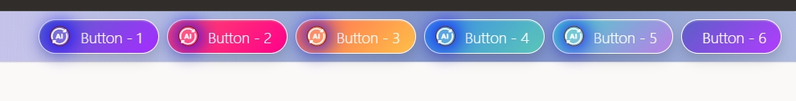

# Custom Button Style On Oracle APEX
This custom Oracle APEX button style creates a modern, vibrant, and professional user interface element with a glossy gradient appearance. The design features rounded corners, soft shadows, and colorful gradient backgrounds that enhance the visual appeal of applications.

### Key Features

- **Gradient Backgrounds**
  - Each button uses a unique multi-color gradient to create a modern and attractive look.
  - Different color schemes can be applied for various actions or categories.

- **Rounded Corners**
  - Large border-radius values provide a smooth, pill-shaped appearance.
  - Improves aesthetics and user experience.

- **Glassmorphism Effect**
  - Semi-transparent overlays and subtle borders create a glass-like appearance.
  - Gives the buttons a premium, modern UI feel.

- **Hover Animation**
  - Smooth transitions when users move the mouse over the button.
  - Can include slight scaling, glow effects, or color shifts.

- **Shadow Effects**
  - Soft box shadows add depth and make buttons stand out from the page background.
  - Enhances visual hierarchy.

- **Icon Integration**
  - Supports Oracle APEX Font APEX or Font Awesome icons.
  - Icons can be placed before the button text for improved usability.

- **Responsive Design**
  - Adapts seamlessly to different screen sizes and devices.
  - Suitable for desktop, tablet, and mobile applications.
    
### Typical Use Cases
- Dashboard navigation buttons
- Quick action menus
- Application launchers
- Workflow action buttons
- Modern portal interfaces

### Demo


### Step # 01 : Core CSS
- Add below code on Inline CSS
```
/* Button Style */
.t-Button--sr {
    position: relative;
    border: 1px solid white;
    border-radius: 25px;
    padding: 10px 0px 10px 25px;
    min-width: 120px;
    height: 35px;
    color: #fff !important;
    font-weight: 100;
    font-size: 15px;
    background: linear-gradient(135deg, #5b5fc7, #b23cff);
    box-shadow: 0 6px 12px rgba(0, 0, 0, .15), inset 0 1px 1px rgba(255, 255, 255, .25);
    /* transition: all .3s ease; */
}
.t-Button--sr:hover {
    /* transform: translateY(-2px); */
    box-shadow: 0 10px 18px rgba(0,0,0,.20), inset 0 1px 1px rgba(255,255,255,.25);
}
/* Circular Icon Area */
.t-Button--sr .fa, .t-Button--sr .t-Icon {
    position: absolute;
    left: 10px;
    top: 50%;
    transform: translateY(-50%);
    width: 20px;
    height: 20px;
    line-height: 18px;
    text-align: center;
    border-radius: 50%;
    border: 1px solid rgb(98 0 0 / 80%);
    box-shadow: 0px 0px 20px 3px blue;
    background: rgba(255, 255, 255, .12);
    color: #fff;
}
/* Color Variations */
.btn-1 {
    background: linear-gradient(135deg, #5865c7, #a62cff) !important;
}
.btn-2 {
    background: linear-gradient(135deg, #ff4b6e, #ff008a) !important;
}
.btn-3 {
    background: linear-gradient(135deg, #ff6b57, #ffbf47) !important;
}
.btn-4 {
    background: linear-gradient(135deg, #3c8ce7, #5bc6b8) !important;
}
.btn-5 {
    background: linear-gradient(135deg, #45d4c8, #bc7ee8) !important;
}

.t-Button--sr-icon {
    position: relative;
    border: 1px solid white;
    border-radius: 25px;
    padding: 10px 0px 10px 0px;
    min-width: 100px;
    height: 35px;
    color: #fff !important;
    font-weight: 100;
    font-size: 15px;
    background: linear-gradient(135deg, #5b5fc7, #b23cff);
    box-shadow: 0 6px 12px rgba(0, 0, 0, .15), inset 0 1px 1px rgba(255, 255, 255, .25);
}
```
### Step # 02 : Use case css class
- ==> Create a button and go to Appearance
- ==> CSS Classes : 
```
t-Button--sr btn-1
```
